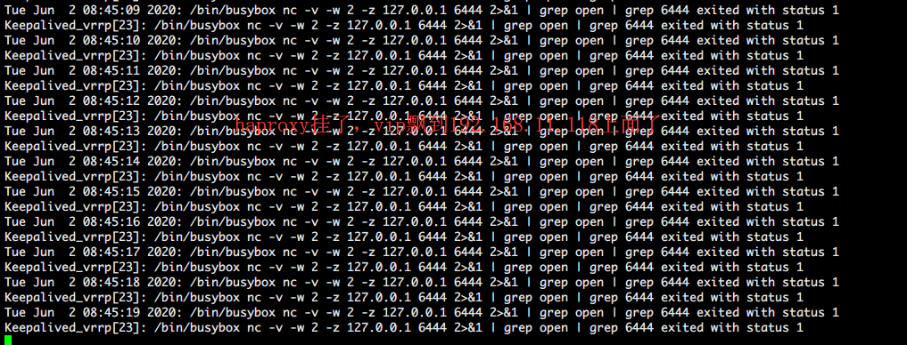

##大致环境说明一下    
有两台master 一台是192.168.11.122 ， 192.168.11.118 ,   
122的网卡名为eth0，118的网卡名为eth0，    
这个在keepalived的docker要注意一下，    
122上面有安装kubernetes，    
而118上没有安装，    
所以用nc来开一个6443的端口来模拟api-server的服务    

192.168.11.127是VIP        
haproxy和keepalived镜像地址：       
docker pull qjpoo/haproxy-k8s        
docker pull qjpoo/keepalived-k8s   
###haproxy.cfg 配置文件,放在了/tmp/a目录下面

cat haproxy.cfg

```
global
log 127.0.0.1 local0
log 127.0.0.1 local1 notice
maxconn 4096
#chroot /usr/share/haproxy
#user haproxy
#group haproxy
daemon

defaults
    log     global
    mode    http
    option  httplog
    option  dontlognull
    retries 3
    option redispatch
    timeout connect  5000
    timeout client  50000
    timeout server  50000

frontend stats-front
  bind *:8081
  mode http
  default_backend stats-back

frontend fe_k8s_6444
  bind *:6444
  mode tcp
  timeout client 1h
  log global
  option tcplog
  default_backend be_k8s_6443
  acl is_websocket hdr(Upgrade) -i WebSocket
  acl is_websocket hdr_beg(Host) -i ws

backend stats-back
  mode http
  balance roundrobin
  stats uri /haproxy/stats
  stats auth pxcstats:secret

backend be_k8s_6443
  mode tcp
  timeout queue 1h
  timeout server 1h
  timeout connect 1h
  log global
  balance roundrobin
  server master01 192.168.11.122:6443 check inter 2000 rise 2 fall 3
  server master02 192.168.11.118:6443 check inter 2000 rise 2 fall 3
```


192,168.11.122上执行

```
docker run -d --restart=always \
--name haproxy \
-p 6444:6444 \
-e MasterIP1=192.168.11.122 \
-e MasterIP2=192.168.11.118 \
-e MasterPort=6443 \
-v /tmp/a/haproxy.cfg:/usr/local/etc/haproxy/haproxy.cfg \
qjpoo/haproxy-k8s
```


```
docker run -itd --restart=always \
--name=keepalived \
--net=host --cap-add=NET_ADMIN \
-e VIRTUAL_IP=192.168.11.127 \
-e INTERFACE=eth0 \
-e CHECK_PORT=6444 \
-e RID=10 \
-e VRID=160 \
-e NETMASK_BIT=24 \
-e MCAST_GROUP=224.0.0.18 \
qjpoo/keepalived-k8s
```
------------


###在192.168.11.118上执行 由于我在118上没有安装kubernetes，所以用nc来模拟一个6443的端口
nc -l -k 6443


```
docker run -d --restart=always \
--name haproxy \
-p 6444:6444 \
-e MasterIP1=192.168.11.122 \
-e MasterIP2=192.168.11.118 \
-e MasterPort=6443 \
-v /tmp/a/haproxy.cfg:/usr/local/etc/haproxy/haproxy.cfg \
qjpoo/haproxy-k8s
```


```
docker run -itd --restart=always --name=keepalived \
--net=host --cap-add=NET_ADMIN \
-e VIRTUAL_IP=192.168.11.127 \
-e INTERFACE=ens3 \
-e CHECK_PORT=6444 \
-e RID=10 \
-e VRID=160 \
-e NETMASK_BIT=24 \
-eMCAST_GROUP=224.0.0.18 \
qjpoo/keepalived-k8s
```


## 测试
1）首先把192.168.11.122上的haproxy停用，看vip会不会到192.168.11.118上         
    
   
    

2）首先把192.168.11.122上的keepalived停用，看vip会不会到192.168.11.118上


---
没有配置成抢占模式，当192.168.11.122业务都恢复正常了之后，VIP是不会到192.168.11.122上面的来

